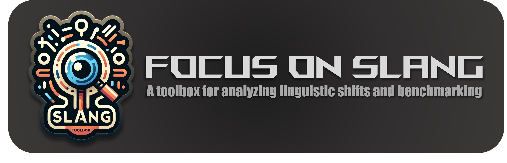

# [EMNLP 2024 Main] SLANG Benchmark and FOCUS Methodology Toolbox

[](https://arxiv.org/abs/2401.12585)

[](https://focus-on-slang.meirtz.com/)


## Overview
This toolbox is designed for the collection and construction of datasets for the SLANG benchmark, adeptly catering to the dynamic and multifaceted nature of internet language. It not only addresses slang but also encompasses a wide array of evolving online phenomena such as memes, viral phrases, and emerging linguistic concepts. This comprehensive approach ensures a robust understanding of the ever-changing landscape of internet communication. Additionally, the toolbox implements the FOCUS methodology, an innovative approach for deciphering linguistic shifts in online communication.

## Features
- **Real-time Data Collection**: Automated tools to gather the latest slang and linguistic trends from various online sources.
- **Dataset Construction**: Robust methods to build and structure datasets suitable for the SLANG benchmark.
- **SLANG Method Implementation**: Tools to test and evaluate language models against the SLANG benchmark.
- **FOCUS Methodology**: Incorporates causal inference to enhance language model comprehension of evolving internet language.

**The raw data *data/words_raw_Feb_2024.json* is now available.**

## Installation

1. Clone the repository:
    ```bash
    git clone https://github.com/Meirtz/FocusOnSlang-Toolbox.git
    cd FocusOnSlang-Toolbox
    ```

2. Set up a virtual environment and install dependencies:
    ```bash
    python -m venv venv
    source venv/bin/activate   # On Windows, use `venv\Scripts\activate`
    pip install -r requirements.txt
    ```

    

## Usage

To run the main script, use the following command:

```bash
python run.py
```

Examples:
```
python run.py --data "data/words_transformed_all_fewshot_v2_all.json" --model_name "gpt-3.5-turbo-1106" --sample
```


### Parameters

- `data\words_transformed_all_fewshot_v2_all.json`: Path to the input JSON file containing the slang terms.
- `model_name='gpt-3.5-turbo-1106'`: The name of the LLM model to be used.
- `sample_num="300:357"`: Range of samples to process.
- `template_name='Direct'`: Template or method for processing the input data.

## Configuration

To change the configuration, edit the parameters in `run.py` or pass different arguments when calling the script.

## Input Data Format

The input JSON file should contain the slang terms in a specific format. Here’s an example:

```json
{
    "slang_terms": [
        "example_slang_1",
        "example_slang_2",
        ...
    ]
}
```

## Output

The script processes the input data and prints the results to the console. The total cost of using the LLM is also displayed.

## Cost Calculation

The total cost is calculated based on the usage of the LLM model. The cost is printed at the end of the script execution.


## Contributing

We welcome contributions! Please open an issue or submit a pull request with your improvements.

## Citation

If you use this toolbox for your research, please cite our paper:

```bibtex
@misc{mei2024slangnewconceptcomprehension,
      title={SLANG: New Concept Comprehension of Large Language Models}, 
      author={Lingrui Mei and Shenghua Liu and Yiwei Wang and Baolong Bi and Xueqi Cheng},
      year={2024},
      eprint={2401.12585},
      archivePrefix={arXiv},
      primaryClass={cs.CL},
      url={https://arxiv.org/abs/2401.12585}, 
}
```

## License

This project is licensed under the MIT License. See the [LICENSE](LICENSE) file for details.

 
